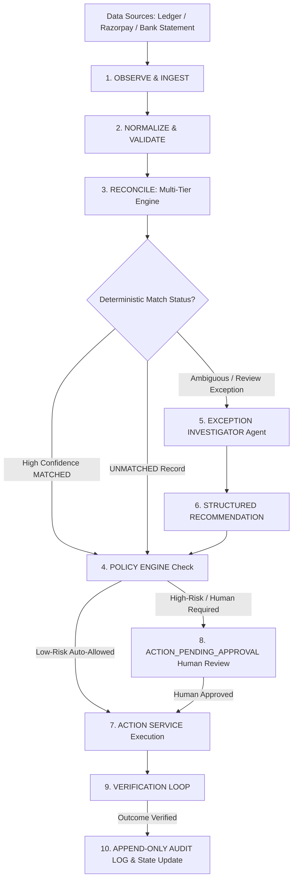

# LedgerLens: AI-Powered Financial Reconciliation Engine

LedgerLens is a deterministic, evidence-based, and bounded Groq AI financial reconciliation engine designed to compare internal transaction ledgers against external bank/settlement statements with high precision, auditability, and safety.

---

## Problem
Financial reconciliation is a critical accounting process where internal sales/orders ledgers must be matched against bank statement credits. Manual reconciliation is slow, expensive, and error-prone due to:
- Gateway fee deductions (e.g. 5,000 INR order credited as 4,950 INR with a 50 INR MDR fee).
- Settlement delays (1 to 3 days posting vs settlement date gaps).
- Narration noise, truncation, OCR errors, and missing order IDs.
- Ambiguous near-duplicate transactions on identical dates.

---

## Solution
LedgerLens solves financial reconciliation through a 10-step **Bounded Financial Reconciliation Agent Loop**:
1. **Perception & Ingestion**: Ingests internal ledgers, Razorpay settlement exports, and bank statements.
2. **Normalization & Schema Validation**: Converts amounts to numeric floats, normalizes dates to ISO, and strips text noise.
3. **Multi-Tier Deterministic Engine**: Matches exact references and unique amount/date candidates (73%+ of records).
4. **Exception Investigator**: Dispatches AI/rule-based investigation to analyze discrepancies (fees, date shifts, conflicts).
5. **Deterministic Policy Engine**: Enforces strict financial tolerances (e.g., ₹100 max fee auto-adjustment) and risk tiers.
6. **Action Handlers & Verification**: Idempotently executes low-risk actions and runs a post-execution outcome verification loop.
7. **Human-in-the-Loop Approval**: Escalates high-risk or ambiguous cases (`ACTION_PENDING_APPROVAL`) for human sign-off.
8. **Append-Only Audit Trail**: Logged immutable audit events (`AuditEvent`) capturing full state transition histories.

---

## Bounded Agent Workflow Loop



---

## Core Agent Components

### 1. Stateful Case Machine (`src/agent/models.py`)
Manages reconciliation cases through explicit deterministic states: `NEW` → `INGESTING` → `NORMALIZING` → `RECONCILING` → `INVESTIGATING` → `RECOMMENDATION_READY` → `POLICY_APPROVED` → `ACTION_EXECUTING` → `ACTION_VERIFYING` → `RESOLVED`.

### 2. Exception Investigator (`src/agent/investigator.py`)
Analyzes transaction exceptions (`FEE_ADJUSTMENT`, `DATE_MISMATCH`, `ONE_TO_ONE_CONFLICT`, `CURRENCY_MISMATCH`, `BATCH_AGGREGATE_SUSPECTED`) and produces structured, typed recommendations.

### 3. Deterministic Policy Engine (`src/agent/policy.py`)
Enforces strict financial boundaries:
- **Fee Adjustment Tolerance**: Auto-adjustment allowed **only** if fee variance $\le ₹100.0$.
- **Auto-Match Threshold**: Auto-approval allowed **only** if confidence score $\ge 0.82$.
- **Prompt Injection Defense**: Defense-in-depth sanitization (`sanitize_untrusted_text`) stripping control characters, redacting URLs (`[REDACTED_URL]`), limiting character flooding (`[REDACTED_FLOOD]`), sanitizing jailbreak/override phrases (`[REDACTED_TEXT]`), and truncating untrusted text.
- **Risk Tiers**: Automatically assigns `LOW`, `MEDIUM`, or `HIGH` risk tiers.

### 4. Action Handlers & Outcome Verification (`src/agent/actions.py`)
Bounded actions (`MARK_RECONCILED`, `CREATE_FEE_ADJUSTMENT`, `FLAG_FOR_REVIEW`, `MARK_UNMATCHED`) run through post-execution verification checks and idempotency guards (`case_id:action_type` lookup).


---

## Role of AI
- **Bounded Invocation**: The LLM is NEVER used as the primary matcher. It is invoked **only** for ambiguous records reaching `REVIEW`.
- **Candidate Pool Restricting**: The engine passes ONLY the top 3 deterministically generated candidates to the LLM.
- **Deterministic Vetoes**: If the LLM returns a `selected_bank_id` outside the candidate pool, `ai_matcher` vetoes the decision and forces `same_transaction = False` and status `REVIEW`.
- **Safe Fallback**: API key absence, rate limits (HTTP 429), network errors, or malformed JSON output safely default to `REVIEW`.

---

## Dataset & Evaluation
LedgerLens includes a controlled synthetic benchmark generator (`scripts/generate_dataset.py`) producing 225+ ledger records and 250+ bank records across 12 scenario classes:
- `EASY_EXACT`, `NOISY_REFERENCE`, `FEE_DIFFERENCE`, `DATE_SHIFT`, `DUPLICATE_NEAR_DUPLICATE`, `AMBIGUOUS`, `FALSE_POSITIVE_TRAP`, `AMOUNT_NEAR_MATCH`, `UNMATCHED_LEDGER`, `UNMATCHED_BANK`, `REVERSAL_ADJUSTMENT`, `FEE_ONLY_SETTLEMENT`.

**Benchmark Performance**:
- **Pair Precision**: `0.9639`
- **Pair Recall**: `1.0000`
- **F1 Score**: `0.9816`
- **Deterministic Match Rate**: `73.78%`
- **AI Escalation Rate**: `23.11%`

---

## Installation & Setup

1. **Clone Repository & Install Dependencies**:
   ```bash
   git clone https://github.com/ZigzagDeck/LedgerLens.git
   cd LedgerLens
   pip install -r requirements.txt
   ```

2. **Configure Environment Secrets**:
   ```bash
   cp .env.example .env
   ```
   *(Optional: Edit `.env` to add your `GROQ_API_KEY` for live AI inference)*

---

## Developer Commands

- **Run Pytest Test Suite**:
  ```bash
  python -m pytest -q
  ```

- **Generate Benchmark Dataset**:
  ```bash
  python -m scripts.generate_dataset --seed 123 --ledger-count 200 --bank-count 200 --output-dir data
  ```

- **Run Repository & Data Audit**:
  ```bash
  python -m scripts.audit_repo
  ```

- **Run Benchmark Evaluator**:
  ```bash
  python -m scripts.run_benchmark
  ```

- **Run Throughput Benchmark**:
  ```bash
  python -m scripts.run_throughput
  ```

- **Launch FastAPI REST Server**:
  ```bash
  uvicorn api.server:app --reload
  ```

- **Launch Streamlit Web App**:
  ```bash
  streamlit run app/app.py
  ```

---

## Custom XLSX Usage

Save custom operational files to `data/custom/`:
- `data/custom/ledger.xlsx`
- `data/custom/bank_statement.xlsx`

Or upload via REST API:
```bash
curl -X POST "http://127.0.0.1:8000/api/v1/custom-data/upload" \
  -F "file_type=ledger" \
  -F "file=@path/to/ledger.xlsx"
```

---

## API Observability (Standard Mode vs Debug Mode)

### Standard Mode (`GET /api/v1/health` & `POST /api/v1/reconcile`):
Returns clean summary metrics suitable for production dashboards:
```json
{
  "status": "success",
  "data_source": "default_benchmark",
  "total_records": 258,
  "summary": {
    "matched": 166,
    "review": 52,
    "unmatched": 40
  }
}
```

### Debug Mode (`POST /api/v1/reconcile?debug=true`):
Exposes structured transaction traces per record for developer audit:
```json
{
  "ledger_id": "ORD-1111",
  "bank_id": "UTR500111",
  "status": "REVIEW",
  "matching_rule": "AI_REVIEW_REQUIRED",
  "score": 0.72,
  "reason": "AI Review: Rate limit reached. Safe fallback to REVIEW.",
  "decision_source": "groq",
  "ai_invoked": true,
  "candidate_count": 3,
  "amount_difference": 50.0,
  "date_difference": 0
}
```

---

## Limitations
1. **Multi-Ledger Aggregates**: Payment gateways (e.g. Razorpay) often batch multiple orders into a single net settlement credit. LedgerLens includes a `detect_batch_aggregates()` heuristic detector that identifies candidate order groups within configurable tolerance (default 2%) and date windows (default ±5 days). Full subset-sum optimization for arbitrary 10+ order combinations remains an active area of enhancement.
2. **Multi-Currency Conversion**: Live FX rate conversion is not included; currency mismatches are safely vetoed to `REVIEW`.
